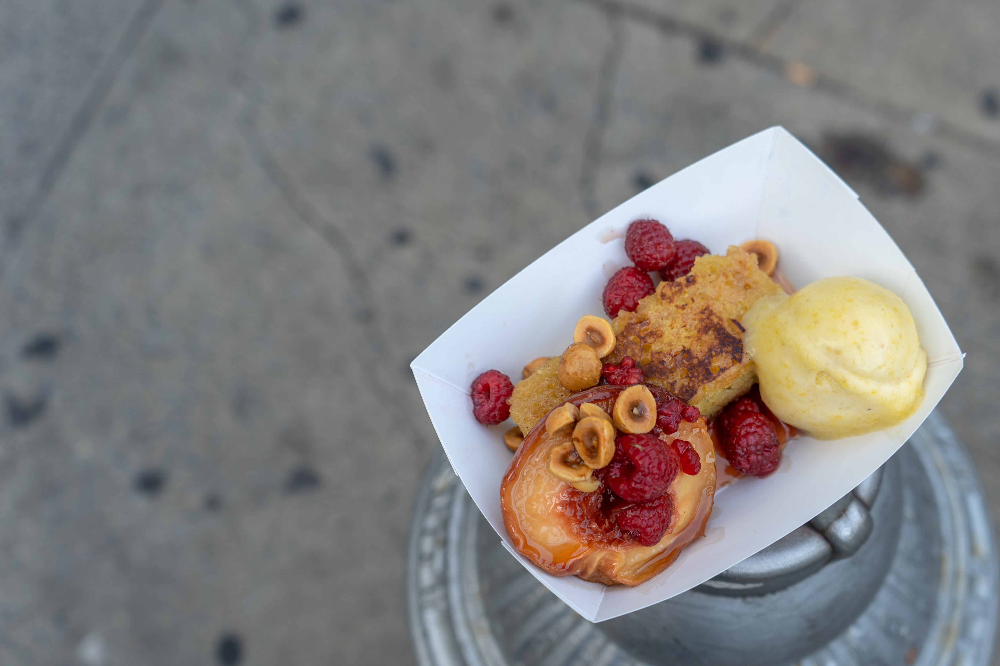

Eating the flavors of summer, part 1: tomatoes from Campo Rosso Farm and Alewife Farm, basil, and creeeeaaaamed corn (says the menu)

Eating the flavors of summer, part 2: griddled semolina cake, a slow roasted white nectarine, red raspberries, fancy hazelnuts, and Anson Mills polenta gelato

